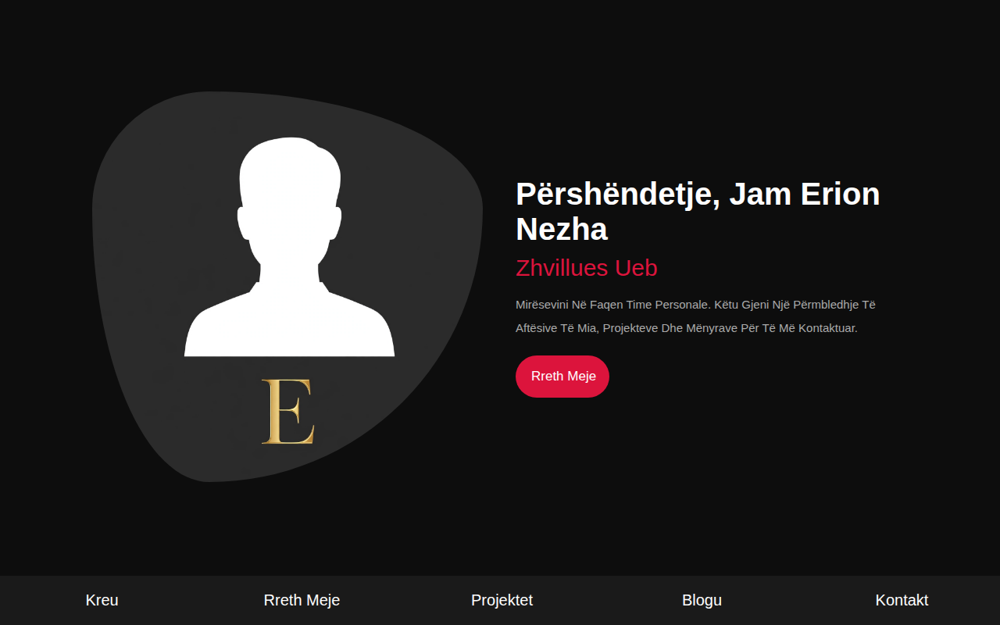

# My-CV — CV Personale Online e Erion Nezha



**Demo live:** https://erionnezha.github.io/My-CV/

Faqe personale CV e **Erion Nezha**, e përshtatur plotësisht në shqip. Një faqe moderne, responsive, me seksione për prezantim, aftësi, projekte, blog dhe kontakt.

## Hapet lokalisht

1. Shkarkoni ose klononi këtë repo.
2. Hapni `index.html` në shfletues — nuk kërkon server apo build.

```bash
git clone https://github.com/ErionNezha/My-CV.git
cd My-CV
# hap index.html në shfletues
```

## Faqet

- `index.html` — Kreu: prezantimi i Erion Nezha
- `about.html` — Rreth meje: të dhënat personale + aftësitë
- `portfolio.html` — Projektet
- `blogs.html` — Blogu
- `contact.html` — Kontakt: Tiranë, Shqipëri · +355 699 552 080 · erjonnezhaa@gmail.com

## Teknologjitë

HTML5, CSS3 (me SCSS), Font Awesome 5 — pa JavaScript framework, pa build-step.

## Licenca

MIT — shiko [LICENSE](LICENSE). Copyright (c) 2026 Erion Nezha.

---

# My-CV — Erion Nezha's Online CV


**Live demo:** https://erionnezha.github.io/My-CV/

The personal CV website of **Erion Nezha**, fully localized in Albanian. A modern, responsive one-page-style site with sections for introduction, skills, projects, blog and contact.

## Run locally

1. Download or clone this repo.
2. Open `index.html` in a browser — no server or build step required.

```bash
git clone https://github.com/ErionNezha/My-CV.git
cd My-CV
# open index.html in your browser
```

## Pages

- `index.html` — Home: Erion Nezha's introduction
- `about.html` — About: personal info + skills
- `portfolio.html` — Projects
- `blogs.html` — Blog
- `contact.html` — Contact: Tirana, Albania · +355 699 552 080 · erjonnezhaa@gmail.com

## Tech

HTML5, CSS3 (with SCSS source), Font Awesome 5 — no JS framework, no build step.

## License

MIT — see [LICENSE](LICENSE). Copyright (c) 2026 Erion Nezha.
